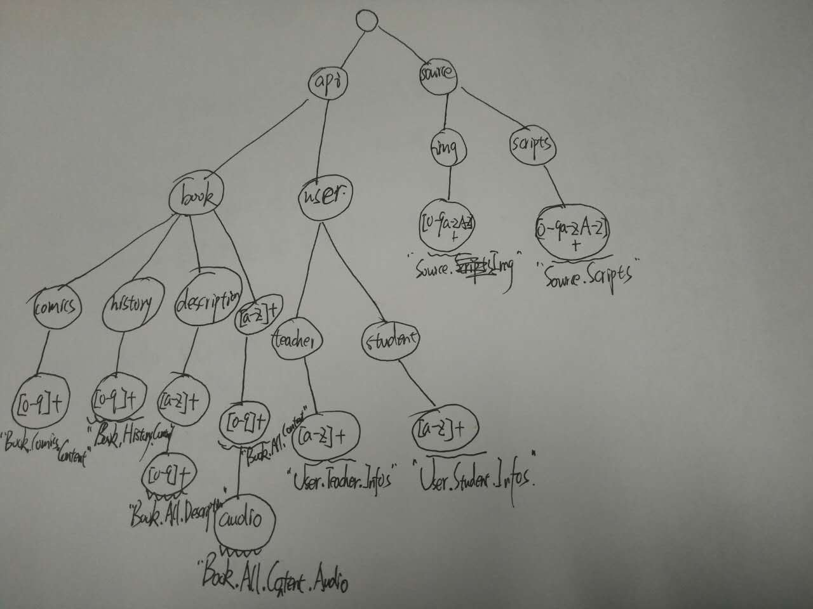

##小作业总结
在对作业要求分析之后可知搜索核心是实现***具体大于一般原则***，最开始使用的是暴力匹配法：针对每个`path`，将其与n条`pattern`进行匹配，要实现上述规则只能先将特殊规则挑选出来优先匹配，具体实现见`core_pre.py`,然而当数量太多时区分具体规则与一般规则很困难并且难以合理添加规则，算法复杂度也较高。受到字典树的启发，我构建了**搜索树**来完成该作业，实现见`core.py`。

 

下面大概描述下算法实现细节：
####1.利用匹配规则构建搜索树：

（手画的，有点丑。。。） 
针对待匹配`path`,将其用'/'拆分后，从根节点向下进行搜索。

####2.算法特点：
（1）满足***具体大于一般原则***，不需要预先对规则进行判定。 
（2）可以对已有的搜索树添加规则，具有可扩展性 
（3）利用路径的公共前缀来减少匹配时间，最大限度减少无谓规则的匹配

####3.会返回None的规则说明
（1） path与pattern(字符串或正则表达式)不匹配：如规则为`/api/book/comics/[0-9]+`,path为`/api/book/comics/12e3` 
（2） path比规则长：如`/api/book/history/[0-9]+`与`/api/book/history/123/hello`
(3) 个人从逻辑上觉得路径`/api/book/comics/123/audio`应该是优先匹配规则`/api/book/comics/[0-9]+`而不是`/api/book/[a-z]+/[0-9]+/audio`，因此针对该path，应该添加规则应该为`/api/book/comics/[0-9]+/audio`

####4.时间复杂度分析
生成搜索树：对于m条长度为t的规则生成的搜索树时间复杂度为O(mt),pattern的长度较短，如在[4,8]范围内变换，因此时间复杂度为O(m).
搜索：类似的，n条规则搜索时间复杂度为O(n)

###最后，算法还有待改进的地方，敬请审阅并给与修改意见！！谢谢